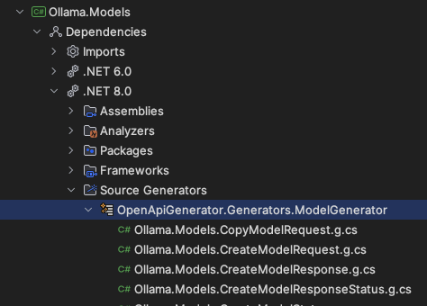

# AutoSDK
The goal of this project is to automate and minimize the effort of maintaining high-quality .NET SDKs generated based on the OpenAPI specification, mainly to strengthen the AI ecosystem within .NET. The code generated by this library is also actively used in [dozens of our various SDKs of varying complexity levels](#examples-of-use-in-real-sdks) and in [the LangChain.NET project](https://github.com/tryAGI/LangChain), which ensures that it is tested in various scenarios and is ready for them.  
Inspired by [NSwag](https://github.com/RicoSuter/NSwag) ❤️.

## 🔥Features🔥
- Uses Incremental Source Generators for efficient generation and caching.
- Detects your TargetFramework and generates optimal code for it (including net6.0/net7.0/net8.0 improvements)
- Supports .Net Framework/.Net Standard
- Does not contain dependencies for modern versions of dotnet
- Only System.Text.Json dependency for .Net Framework/.Net Standard
- Any generated methods provide the ability to pass a CancellationToken
- Allows partial generation (models only) or end points filtering
- Available under MIT license for general users and most organizations
- Uses https://github.com/microsoft/OpenAPI.NET for parsing OpenAPI specification
- Supports nullable enable/trimming/native AOT compilation/CLS compliance
- Tested on GitHub 220k lines OpenAPI specification
- Supports OneOf/AnyOf/AllOf/Not schemas
- Supports Enums for System.Text.Json
- Supports SSE (Server-Sent Events) through the `application/x-ndjson` content type
- Efficient O(n) implementation, fully suitable for large/super large OpenAPI specifications
- Used in 10+ real SDKs and adapted to solve various problems

# 🚀Quick start🚀
## CLI (Recommended)
You can use the CLI to generate the code.
```bash
dotnet tool install --global autosdk.cli --prerelease
rm -rf Generated
autosdk generate openapi.yaml \
    --namespace Namespace \
    --clientClassName YourApi \
    --targetFramework net8.0 \
    --output Generated
```
It will generate the code in the "Generated" subdirectory.  
It also will include polyfills for .Net Framework/.Net Standard TargetFrameworks.

## Source generator
- Install the package
```bash
dotnet add package AutoSDK.SourceGenerators
```
- Add the following optional settings to your csproj file to customize generation. You can check all settings [here](https://github.com/tryAGI/AutoSDK/blob/main/src/libs/AutoSDK.SourceGenerators/AutoSDK.SourceGenerators.props):
```xml
<!-- This generator automatically detects all .yaml files in the project directory and adds them to the generation -->
<!-- If your yaml file is not in the project directory, you can specify it manually -->
<ItemGroup Label="AutoSDK">
    <AdditionalFiles Include="$(MSBuildThisFileDirectory)../../../docs/openapi.yaml" />
</ItemGroup>

<!-- All settings optional -->
<PropertyGroup Label="AutoSDK">
    <AutoSDK_Namespace>Ollama</AutoSDK_Namespace>
    <AutoSDK_ClassName>OllamaApi</AutoSDK_ClassName>

    <!-- By default, it generates all models/methods. You can disable this behavior using these properties -->
    <AutoSDK_GenerateSdk>false</AutoSDK_GenerateSdk>
    <AutoSDK_GenerateModels>true</AutoSDK_GenerateModels>
    <AutoSDK_GenerateMethods>true</AutoSDK_GenerateMethods>
    <AutoSDK_GenerateConstructors>true</AutoSDK_GenerateConstructors>
    <AutoSDK_IncludeOperationIds>getPet;deletePet</AutoSDK_IncludeOperationIds>
    <AutoSDK_ExcludeOperationIds>getPet;deletePet</AutoSDK_ExcludeOperationIds>
    <AutoSDK_IncludeModels>Pet;Model</AutoSDK_IncludeModels>
    <AutoSDK_ExcludeModels>Pet;Model</AutoSDK_ExcludeModels>
</PropertyGroup>
```
- It's all! Now you can build your project and use the generated code. You also can use IDE to see the generated code in any moment, this is a example for Rider:  


# Trimming support
## CLI
CLI generates Trimming/NativeAOT compatible code by default.

## Source generator
Since there are two source generators involved, we will have to create a second project so that the generator for the JsonSerializerContext will “see” our models
- Create new project for your models. And disable methods/constructors generation:
```xml
<PropertyGroup Label="AutoSDK">
    <AutoSDK_GenerateSdk>false</AutoSDK_GenerateSdk>
    <AutoSDK_GenerateModels>true</AutoSDK_GenerateModels>
    <AutoSDK_GenerateJsonSerializerContextTypes>true</AutoSDK_GenerateJsonSerializerContextTypes>
</PropertyGroup>
```
- Reference this project in your main project.
- Add `SourceGenerationContext.cs` file to your main project with the following content:
```csharp
using System.Text.Json.Serialization;

namespace Namespace;

[JsonSourceGenerationOptions(DefaultIgnoreCondition = JsonIgnoreCondition.WhenWritingNull)]
[JsonSerializable(typeof(AutoSDKTrimmableSupport))]
internal sealed partial class SourceGenerationContext : JsonSerializerContext;
```
- Add the following settings to your main csproj file:
```xml
<PropertyGroup Label="AutoSDK">
    <AutoSDK_GenerateSdk>false</AutoSDK_GenerateSdk>
    <AutoSDK_GenerateMethods>true</AutoSDK_GenerateMethods>
    <AutoSDK_GenerateConstructors>true</AutoSDK_GenerateConstructors>
    <AutoSDK_JsonSerializerContext>Namespace.SourceGenerationContext</AutoSDK_JsonSerializerContext>
</PropertyGroup>
```
- Add these settings to your new and main csproj file to enable trimming(or use Directory.Build.props file):
```xml
<PropertyGroup Label="Trimmable" Condition="$([MSBuild]::IsTargetFrameworkCompatible('$(TargetFramework)', 'net6.0'))">
    <IsAotCompatible>true</IsAotCompatible>
    <EnableTrimAnalyzer>true</EnableTrimAnalyzer>
    <IsTrimmable>true</IsTrimmable>
    <SuppressTrimAnalysisWarnings>false</SuppressTrimAnalysisWarnings>
    <TrimmerSingleWarn>false</TrimmerSingleWarn>
</PropertyGroup>
```
- It's all! Now you can build your project and use the generated code with full trimming/nativeAOT support.

## 📚Examples of use in real SDKs📚
- https://github.com/tryAGI/OpenAI
- https://github.com/tryAGI/Ollama
- https://github.com/tryAGI/Anthropic
- https://github.com/tryAGI/LangSmith
- https://github.com/tryAGI/Replicate
- https://github.com/tryAGI/DeepInfra
- https://github.com/tryAGI/Leonardo
- https://github.com/HavenDV/GitHub.NET