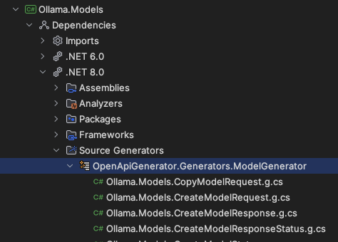

# AutoSDK
The goal of this project is to automate and minimize the effort of maintaining high-quality .NET SDKs generated based on OpenAPI and AsyncAPI specifications, mainly to strengthen the AI ecosystem within .NET. The code generated by this library is also actively used in [dozens of our various SDKs of varying complexity levels](#examples-of-use-in-real-sdks) and in [the LangChain.NET project](https://github.com/tryAGI/LangChain), which ensures that it is tested in various scenarios and is ready for them.  
Inspired by [NSwag](https://github.com/RicoSuter/NSwag) ❤️.

## 🔥Features🔥
- Detects your TargetFramework and generates optimal code for it (including net6.0/net7.0/net8.0 improvements)
- Supports .Net Framework/.Net Standard
- Supports OpenAPI 3.1 specs via compatibility normalization (nullability, examples, const, `unevaluatedProperties`, tuple-style arrays, and string content keywords)
- Does not contain dependencies for modern versions of dotnet.
- Only System.Text.Json dependency for .Net Framework/.Net Standard
- Any generated methods provide the ability to pass a CancellationToken
- Allows partial generation (models only) or end points filtering
- Available under MIT license for general users and most organizations
- Uses https://github.com/microsoft/OpenAPI.NET for parsing OpenAPI specification
- Supports nullable enable/trimming/native AOT compilation/CLS compliance
- Tested on GitHub 220k lines OpenAPI specification
- Supports OneOf/AnyOf/AllOf/Not schemas
- Supports Enums for System.Text.Json
- Supports AsyncAPI specs for WebSocket client generation (send/receive methods, cross-namespace schema referencing)
- Supports SSE (Server-Sent Events) through the `application/x-ndjson` content type
- Uses Incremental Source Generators for efficient generation and caching.
- Efficient O(n) implementation, fully suitable for large/super large OpenAPI specifications
- Used in 10+ real SDKs and adapted to solve various problems

# 🚀Quick start🚀
## CLI (Recommended)
You can use the CLI to generate the code.
```bash
dotnet tool install --global autosdk.cli --prerelease
rm -rf Generated
autosdk generate openapi.yaml \
    --namespace Namespace \
    --clientClassName YourApi \
    --targetFramework net8.0 \
    --output Generated
```
It will generate the code in the "Generated" subdirectory.  
It also will include polyfills for .Net Framework/.Net Standard TargetFrameworks.

## HTTP Artifacts
`autosdk http` emits executable request files for regular OpenAPI path operations. It also surfaces response links and callbacks as commented documentation blocks next to the owning operation, and writes root-level OpenAPI webhooks to `webhooks.http` as inbound contract documentation instead of outbound client calls.

## OpenAPI 3.1 Compatibility
AutoSDK normalizes the OpenAPI 3.1 / JSON Schema 2020-12 keywords it can translate cleanly into the current generation pipeline, including `unevaluatedProperties`, `prefixItems`, `unevaluatedItems`, `contentEncoding`, and `contentMediaType`.

Keywords that are still not representable in the current .NET model pipeline, such as `patternProperties` and `contains`/`minContains`/`maxContains`, now fail fast with a targeted error instead of being silently ignored.

## Raw Model Data
Fast-moving APIs can return fields that are not present in the OpenAPI schema yet. Enable `--generate-raw-model-data` in the CLI, or set `<AutoSDK_GenerateRawModelData>true</AutoSDK_GenerateRawModelData>` for the source generator, to emit typed raw JSON extension data on generated models.

With System.Text.Json, unknown fields are preserved as `JsonElement` values in `AdditionalProperties`, and generated models also expose `FromRawUnchecked(...)` / `ToRawJson(...)` helper aliases. This mode is useful for SDK repos where provider docs or live responses move faster than the checked-in spec, while the default lightweight model shape remains unchanged.

## Vendor Extension Compatibility
When `AutoSDK_UseExtensionNaming` or `--use-extension-naming` is enabled, AutoSDK consumes a curated set of third-party SDK metadata instead of treating every vendor extension as noise.

| Concern | Supported today | Intentionally ignored for now |
| --- | --- | --- |
| Naming and grouping | `x-fern-sdk-method-name`, `x-fern-sdk-group-name`, `x-fern-type-name`, `x-oaiMeta.name`, `x-speakeasy-name-override`, `x-speakeasy-group`, `x-stainless-naming` for `.NET` / `csharp` names | `x-speakeasy-model-namespace`, non-.NET `x-stainless-naming` blocks |
| Filtering and deprecation | `x-fern-ignore`, `x-hidden`, `x-speakeasy-ignore`, `x-stainless-skip` when it explicitly targets `.NET`, `x-speakeasy-deprecation-message`, `x-stainless-deprecation-message` | language skips for other ecosystems |
| Enum metadata | `x-enum-varnames`, `x-enum-descriptions`, `x-fern-enum`, `x-speakeasy-enums`, `x-speakeasy-enum-descriptions` | `x-speakeasy-enum-format` |
| Examples and docs | `x-codeSamples`, `x-displayName`, `x-label` | language-specific doc overlays such as `x-speakeasy-docs` |
| Runtime behavior | `x-stainless-const` | pagination, retries, globals, server selection, auth/runtime hints, and liblab config-only metadata |

That split is deliberate: AutoSDK consumes metadata that directly improves generated .NET names, docs, deprecations, and enum surfaces today, while broader runtime features stay tracked as separate issues instead of being silently half-implemented.
## Source generator
- Install the package
```bash
dotnet add package AutoSDK.SourceGenerators
```
- Add the following optional settings to your csproj file to customize generation. You can check all settings [here](https://github.com/tryAGI/AutoSDK/blob/main/src/libs/AutoSDK.SourceGenerators/AutoSDK.SourceGenerators.props):
```xml
<ItemGroup Label="AutoSDK">
    <AdditionalFiles Include="$(MSBuildThisFileDirectory)../../../docs/openapi.yaml" AutoSDK_OpenApiSpecification="true" />
</ItemGroup>

<!-- All settings optional -->
<PropertyGroup Label="AutoSDK">
    <AutoSDK_Namespace>Ollama</AutoSDK_Namespace>
    <AutoSDK_ClassName>OllamaApi</AutoSDK_ClassName>

    <!-- By default, it generates all models/methods. You can disable this behavior using these properties -->
    <AutoSDK_GenerateSdk>false</AutoSDK_GenerateSdk>
    <AutoSDK_GenerateModels>true</AutoSDK_GenerateModels>
    <AutoSDK_GenerateMethods>true</AutoSDK_GenerateMethods>
    <AutoSDK_GenerateConstructors>true</AutoSDK_GenerateConstructors>
    <AutoSDK_IncludeOperationIds>getPet;deletePet</AutoSDK_IncludeOperationIds>
    <AutoSDK_ExcludeOperationIds>getPet;deletePet</AutoSDK_ExcludeOperationIds>
    <AutoSDK_IncludeModels>Pet;Model</AutoSDK_IncludeModels>
    <AutoSDK_ExcludeModels>Pet;Model</AutoSDK_ExcludeModels>
</PropertyGroup>
```
- It's all! Now you can build your project and use the generated code. You also can use IDE to see the generated code in any moment, this is a example for Rider:  


# Trimming support
## CLI
CLI generates Trimming/NativeAOT compatible code by default.

## Source generator
Since there are two source generators involved, we will have to create a second project so that the generator for the JsonSerializerContext will “see” our models
- Create new project for your models. And disable methods/constructors generation:
```xml
<PropertyGroup Label="AutoSDK">
    <AutoSDK_GenerateSdk>false</AutoSDK_GenerateSdk>
    <AutoSDK_GenerateModels>true</AutoSDK_GenerateModels>
    <AutoSDK_GenerateJsonSerializerContextTypes>true</AutoSDK_GenerateJsonSerializerContextTypes>
</PropertyGroup>
```
- Reference this project in your main project.
- Add `SourceGenerationContext.cs` file to your main project with the following content:
```csharp
using System.Text.Json.Serialization;

namespace Namespace;

[JsonSourceGenerationOptions(DefaultIgnoreCondition = JsonIgnoreCondition.WhenWritingNull)]
[JsonSerializable(typeof(AutoSDKTrimmableSupport))]
internal sealed partial class SourceGenerationContext : JsonSerializerContext;
```
- Add the following settings to your main csproj file:
```xml
<PropertyGroup Label="AutoSDK">
    <AutoSDK_GenerateSdk>false</AutoSDK_GenerateSdk>
    <AutoSDK_GenerateMethods>true</AutoSDK_GenerateMethods>
    <AutoSDK_GenerateConstructors>true</AutoSDK_GenerateConstructors>
    <AutoSDK_JsonSerializerContext>Namespace.SourceGenerationContext</AutoSDK_JsonSerializerContext>
</PropertyGroup>
```
- Add these settings to your new and main csproj file to enable trimming(or use Directory.Build.props file):
```xml
<PropertyGroup Label="Trimmable" Condition="$([MSBuild]::IsTargetFrameworkCompatible('$(TargetFramework)', 'net6.0'))">
    <IsAotCompatible>true</IsAotCompatible>
    <EnableTrimAnalyzer>true</EnableTrimAnalyzer>
    <IsTrimmable>true</IsTrimmable>
    <SuppressTrimAnalysisWarnings>false</SuppressTrimAnalysisWarnings>
    <TrimmerSingleWarn>false</TrimmerSingleWarn>
</PropertyGroup>
```
- It's all! Now you can build your project and use the generated code with full trimming/nativeAOT support.

## Known Errors

### Generator error: "Could not write to output file 'Path/to/file'. Could not find part of the path"

This error happens if the generated file path is too long. This happens if you didn't activated long path support on windows.
To enable it follow the offical docs:
https://learn.microsoft.com/en-us/windows/win32/fileio/maximum-file-path-limitation?tabs=registry#registry-setting-to-enable-long-paths
 
# AsyncAPI / WebSocket Support

AutoSDK can generate typed WebSocket clients from [AsyncAPI 3.0](https://www.asyncapi.com/) specifications, producing send/receive methods for each channel operation.

## Basic Usage
```bash
autosdk generate asyncapi.yaml \
    --namespace MyApi.Realtime \
    --websocket-class-name MyRealtimeClient \
    --output Generated
```

This generates:
- A WebSocket client class with connect/disconnect lifecycle
- Typed `Send*` methods for publish operations
- Typed `Receive*` methods (via event callbacks) for subscribe operations
- All associated models, enums, and JSON converters

## Cross-Namespace Schema Referencing

When an API has both REST (OpenAPI) and WebSocket (AsyncAPI) specs that share model types, you can generate them into separate namespaces while avoiding model duplication:

```bash
# Step 1: Generate REST API (models + HTTP client) in main namespace
autosdk generate openapi.yaml \
    --namespace MyApi \
    --clientClassName MyApiClient \
    --output Generated

# Step 2: Generate WebSocket client referencing existing REST types
autosdk generate asyncapi.yaml \
    --namespace MyApi.Realtime \
    --websocket-class-name MyRealtimeClient \
    --types-namespace MyApi \
    --generate-models false \
    --json-serializer-context MyApi.SourceGenerationContext \
    --output Generated
```

Key options:
- `--types-namespace <ns>` — Generated WebSocket client uses `global::<ns>.{TypeName}` references instead of its own namespace
- `--generate-models false` — Skips model/enum/converter generation (they already exist in the types namespace)
- `--json-serializer-context <ctx>` — References an existing `JsonSerializerContext` from the types namespace
- `--websocket-class-name <name>` — Overrides the generated WebSocket client class name

> **Note:** AsyncAPI schema names must match the target namespace's type names. If they differ (e.g., OpenAI where AsyncAPI uses different names), use separate namespaces with full model generation instead.

### Real-world examples
- [tryAGI/OpenAI](https://github.com/tryAGI/OpenAI) — REST API + Realtime WebSocket API
- [tryAGI/ElevenLabs](https://github.com/tryAGI/ElevenLabs) — REST API + Realtime Speech-to-Text WebSocket API
- [tryAGI/Xai](https://github.com/tryAGI/Xai) — REST API + Realtime Voice Agent WebSocket API

## 🤖 Claude Code Skill

AutoSDK is available as a [Claude Code](https://claude.ai/code) skill via [skills.sh](https://skills.sh), enabling AI-assisted SDK generation directly from your terminal.

### Install

```bash
npx skills add tryAGI/AutoSDK@generating-dotnet-sdks
```

### Usage

Once installed, you can use natural language prompts in Claude Code like:
- "Generate a C# SDK from this OpenAPI spec"
- "Scaffold a new AutoSDK project for the Stripe API"
- "Help me customize the generated client with streaming support"

Claude Code will use the skill's knowledge of AutoSDK CLI options, project conventions, and customization patterns to produce correct commands and code.

### What's included

The skill provides Claude Code with detailed knowledge of:
- CLI commands and all their options (`generate`, `init`, `http`, `docs`, `convert`, `simplify`, `trim`)
- Standard project structure and the `generate.sh` regeneration pattern
- AsyncAPI / WebSocket client generation and cross-namespace schema referencing
- Post-generation customization (partial classes, client hooks, trimming support)
- Troubleshooting common issues

Skill source: [`skills/generating-dotnet-sdks/`](skills/generating-dotnet-sdks/)

## 📚Examples of use in real SDKs📚
- https://github.com/tryAGI/OpenAI — REST + WebSocket (AsyncAPI)
- https://github.com/tryAGI/ElevenLabs — REST + WebSocket (AsyncAPI)
- https://github.com/tryAGI/Xai — REST + WebSocket (AsyncAPI)
- https://github.com/tryAGI/Ollama
- https://github.com/tryAGI/Anthropic
- https://github.com/tryAGI/LangSmith
- https://github.com/tryAGI/Replicate
- https://github.com/tryAGI/DeepInfra
- https://github.com/tryAGI/Leonardo
- https://github.com/HavenDV/GitHub.NET
